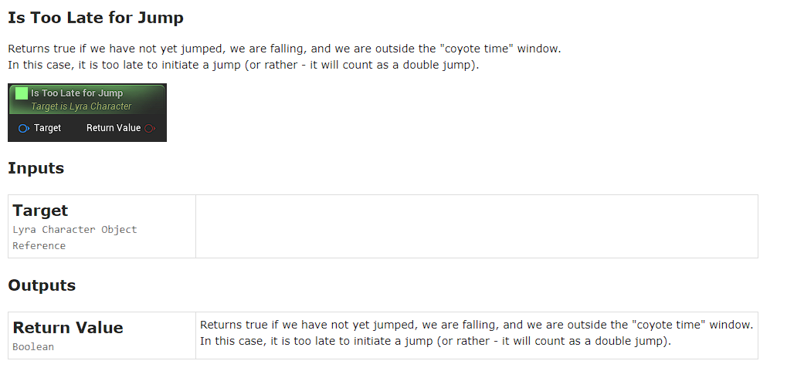

SRG KantanDocGen Plugin
-------------

This plugin is a heavily modified fork of the [KantanDocGen Plugin](https://github.com/kamrann/KantanDocGenPlugin). The original **README** file can be found [here](ORIGINAL_README.md). The plugin is compatible with **Unreal 5.4 and 5.5**. Other versions of Unreal Engine might require modifications to this plugin in order to compile.

Follow Surgent Studio's [video tutorial](https://www.youtube.com/watch?v=lPn_9V_Waew) for a quick setup guide.

# Table of Contents
- [Motivation](#motivation)
    - [What the system is](#what-the-system-is)
    - [What the system is not](#what-the-system-is-not)
- [Changes to the original KantanDocGen Plugin](#changes-to-the-original-kantandocgen-plugin)
- [Installing the plugin](#installing-the-plugin)
- [Documentation Source](#documentation-source)
    - [External](#external-default)
    - [Project Settings](#project-settings)
    - [User Preferences](#user-preferences)
- [Generating Documentation](#generating-documentation)
    - [In Editor](#in-editor)
    - [Executable Command](#executable-command)
- [Usage](#usage)
    - [Access](#access)
    - [Pages](#pages)
- [Future Work](#future-work)

## Motivation

Keeping up to date documentation on a project can be a difficult challenge. It requires time and effort from those working on it to always write new pages or to update existing ones.

In order to alleviate these requirements and make sure documentation keeps being updated (even when tight deadlines make it difficult) we have worked on a system that automatically documents Unreal Engine classes. 

### What the system is:
The system creates a list of HTML pages with information that can be automatically generated from Unreal metadata.

The current focus is in documenting C++ code as that is the information that is least visible to designers. However it can be expanded to document blueprints too.

### What the system is not:
An all-in-one documentation solution. It will not be possible to add documentation for things like VFX, Audio or Art Assets nor is that the intent of it.

## Changes to the original [KantanDocGen Plugin](https://github.com/kamrann/KantanDocGenPlugin)

- Ported to Unreal Engine 5.4 and fixed multiple bugs.
- Added the option for generating documentation through an executable command. More info in the [corresponding section](#executable-command).
- Added auto-documentation for every type of module (plugin / project / engine).
- Added in-editor buttons to access documentation.
- Added more data for each class: parent hierarchy, implemented interfaces and method descriptions.
- Added hyperlink to parent and interfaces of a class.
- Improved visuals for the HTML pages.
- The original [KantanDocGen Plugin](https://github.com/kamrann/KantanDocGenPlugin) was capable of documenting blueprints but that functionality was removed in this version to streamline usage.

## Installing the plugin
To use this plugin you need a C++ Unreal project.
Place the contents of this repository and under *{Project Root}/Plugins/KantanDocGenPlugin*.

After placing the plugins in the correct folder and loading the project go to:
```
Edit → Plugins
```
Search for *KantanDocGen* and turn on the plugin. This will require an engine restart.

## Documentation Source 

The documentation that is opened by the system can originate from various sources.
The source can be selected in:

```
Edit → Editor Preferences → General → Kantan Doc Gen -> Open Documentation Source
```

There are 3 possible sources:

### External (Default)
External means the source of the documentation is a web page. The page's URL can be defined in:
```
Edit → Project Settings → Editor → Kantan Doc Gen -> External Documentation URL
```

This is intended for projects that have [automated their documentation](#executable-command) through the build system and stored it in a server accessible by the team.

### Project Settings

The source of the documentation is defined in:
```
Edit → Project Settings → Editor → Kantan Doc Gen -> Output Directory
```
 
### User Preferences

The source of the documentation is defined in:
```
Edit → Editor Preferences → General → Kantan Doc Gen -> Output Directory
```

User preferences are not shared with source control. This option should only be selected when doing local tests.

## Generating Documentation

There are two different ways of generating documentation:

### In Editor
This generation mode can be accessed in:
```
File → Kantan Doc Gen
```
When generating the documentation this way, the settings are taken from User Preferences:
```
Edit → Editor Preferences → General → Kantan Doc Gen
```


As such, it's advisable to set [documentation source](#documentation-source) to the [user preferences](#user-preferences) option. 

### Executable Command
Generating documentation through an executable command is intended for automation scripts. Ideally a build machine could run the command with a defined cadence and store it in the company's servers to be [externally accessed](#external-default) by the developers.

When generating the documentation this way, the settings are taken from Project Settings:
```
Edit → Project Settings → Editor → Kantan Doc Gen
```


In order to generate documentation through the command line, launch the editor with the following command line argument: 
```
-ExecCmds="-KantanDocGen"
```  
There are a few parameters that can be passed with the command:

|Command | Description|
|---|---|
|**-Generate**|Generates the documentation.|
|**-Open**|Open the documentation (runs after *-Generate*)|
|**-Quit**|Closes the editor (runs after *-Open*)|
|**-Output=*{OutputPath}***|Replaces the output path provided by *Output Directory* in the project settings with *{OutputPath}*. The usage of an absolute path is recommended.|

An example of using all the commands would be:
```
-ExecCmds="-KantanDocGen -Generate -Open -Quit -Output=C:/Test/Documentation/Here"
```

## Usage

The documentation should be quite simple to use. 

### Access
There are 2 ways to access it: 

**Open *{Project}* Documentation** - Accessible from a scene window; Opens the documentation main page.


**Open "*{Class}*" *{Project}* Documentation** - Accessible from any blueprint; Will open the page for the closest C++ parent of *{Class}*.


### Pages 

The documentation itself contains 3 types of pages:

- **Index** - The main page. Divides the documentation into sections for Engine, *{Project}* and all found plugins. It then subdivides each of these into modules and lastly a list of classes per module. Each class contains the name and description for the class.


- **Class** - A page dedicated to a specific class. Contains the class name, description, information about class inheritance and interfaces (if any are implemented), code references and function names and descriptions.


- **Function** - A page dedicated to a specific class. Contains the function name and description, an image that shows how the function looks when used in blueprints and a list of inputs and outputs with their descriptions (if provided).


## Future Work

At the moment, there are no plans to continue working on this documentation.
There are a few features we think would be helpful to add in future. Those are:

- Show *UPROPERTY*s in the class page. 
- Add support for *USTRUCT*s.
- Add support for *UENUM*s.